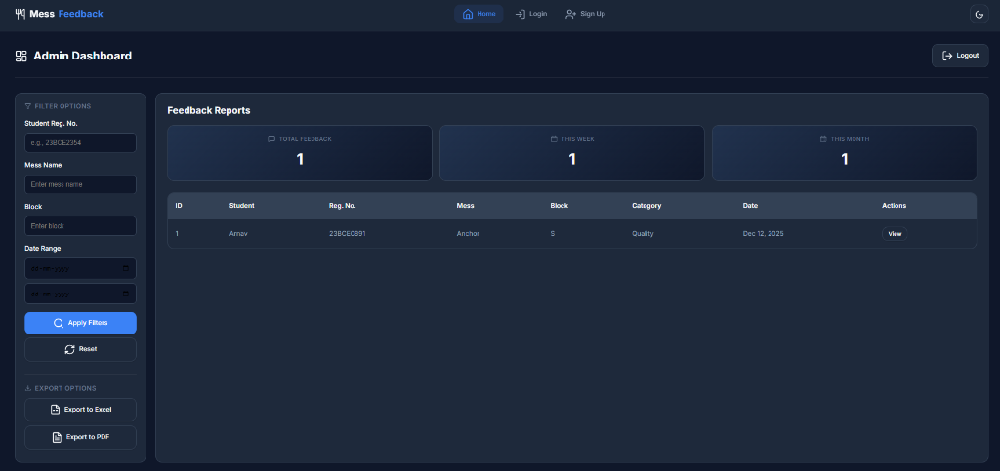

# 📌 Mess Feedback System

A minimal and efficient web platform for collecting and managing student mess feedback. Students can submit detailed feedback and administrators can view, filter, and export reports to improve mess operations.



---

## 🚀 Features

### 👤 Student Side
- Student sign-up and login
- Pre-filled user details in the feedback form
- Submit feedback with:
  - Block & room number
  - Mess name
  - Mess type (Veg / Non-Veg / Special / Night Mess)
  - Category (Quality, Quantity, Hygiene, Timing, Others)
  - Comments / suggestions
  - Optional proof/document upload
- Success and error modals for better user interaction

### 🛠️ Admin Side
- Admin login with secure authentication
- Dashboard with:
  - Total Feedback count
  - This Week's Feedback
  - This Month's Feedback
- Advanced filters:
  - Registration number
  - Mess name
  - Block
  - Date range
- Export filtered data to **Excel** or **PDF**
- View full feedback details in a modal

### 📱 UI & Experience
- Modern, minimal dark-mode design
- Glassmorphism cards and smooth animations
- Fully responsive design
- Floating labels for elegant forms
- Light/Dark theme toggle
- Lucide icons for professional look

---

## 🏗️ Tech Stack

| Layer | Technology |
|-------|------------|
| **Frontend** | HTML5, CSS3, Vanilla JavaScript |
| **Backend** | Node.js, Express.js |
| **Database** | MySQL |
| **Icons** | Lucide Icons |
| **Fonts** | Inter (Google Fonts) |

### Backend Dependencies
- `express` - Web framework
- `mysql2` - MySQL database driver
- `bcrypt` - Password hashing
- `cors` - Cross-origin resource sharing
- `express-session` - Session management
- `exceljs` - Excel export
- `pdfkit` - PDF generation

---

## 🔧 Installation & Setup

### Prerequisites
- Node.js (v14+)
- MySQL Server
- Git

### 1. Clone the Repository
```bash
git clone https://github.com/<your-username>/mess-feedback-system.git
cd mess-feedback-system
```

### 2. Setup the Database
```sql
CREATE DATABASE mess_feedback_system;
USE mess_feedback_system;

-- Run the SQL script
SOURCE Backend/sql/database.txt;
```

Or import `Backend/sql/tables.sql` using MySQL Workbench.

### 3. Configure Database Connection
Edit `Backend/db/index.js`:
```javascript
const dbConfig = {
    host: 'localhost',
    user: 'root',          // Your MySQL username
    password: 'root',      // Your MySQL password
    database: 'mess_feedback_system'
};
```

### 4. Install Backend Dependencies
```bash
cd Backend
npm install
```

### 5. Start the Backend Server
```bash
npm start
```
Backend will run at: `http://localhost:8080`

### 6. Start the Frontend Server
```bash
cd ..
npx serve .
```
Frontend will run at: `http://localhost:3000`

### 7. Open the App
Navigate to: `http://localhost:3000`

---

## 📌 How to Use

### Student Flow
1. **Sign Up** → Create a new student account
2. **Login** → Enter registration number and password
3. **Fill Feedback Form** → Provide mess details and feedback
4. **Attach Proof** (Optional) → Upload supporting documents
5. **Submit** → View success confirmation
6. **Logout** → End session

### Admin Flow
1. **Login** → Enter employee ID and password
2. **View Dashboard** → See feedback statistics
3. **Apply Filters** → Filter by block, mess, date range
4. **Export Data** → Download as Excel or PDF
5. **View Details** → Click to see full feedback
6. **Logout** → End session

---

## 📁 Folder Structure

```
mess-feedback-system/
│
├── index.html          # Main UI with all pages
├── styles.css          # Modern CSS with dark mode
├── script.js           # Frontend logic + API calls
├── hero-preview.png    # Dashboard preview image
├── readme.md           # This file
│
└── Backend/
    ├── index.js        # Express server entry point
    ├── package.json    # Node dependencies
    │
    ├── db/
    │   └── index.js    # Database connection
    │
    ├── routes/
    │   ├── authRoutes.js      # Auth endpoints
    │   └── feedbackRoutes.js  # Feedback endpoints
    │
    ├── controller/
    │   ├── authController.js      # Auth logic
    │   └── feedbackController.js  # Feedback logic
    │
    ├── models/
    │   ├── student.js    # Student model
    │   ├── admin.js      # Admin model
    │   └── feedback.js   # Feedback model
    │
    └── sql/
        ├── database.txt  # Database schema
        └── tables.sql    # Full SQL dump
```

---

## 🔌 API Endpoints

### Authentication
| Method | Endpoint | Description |
|--------|----------|-------------|
| POST | `/auth/student/register` | Register new student |
| POST | `/auth/student/login` | Student login |
| POST | `/auth/admin/register` | Register new admin |
| POST | `/auth/admin/login` | Admin login |
| POST | `/auth/logout` | Logout |
| GET | `/auth/check-auth` | Check authentication status |

### Feedback
| Method | Endpoint | Description |
|--------|----------|-------------|
| POST | `/feedback/submit` | Submit feedback |
| GET | `/feedback/all` | Get all feedback (admin) |
| GET | `/feedback/:id` | Get feedback by ID |
| GET | `/feedback/export/excel` | Export to Excel |
| GET | `/feedback/export/pdf` | Export to PDF |

---

## 🧩 Future Improvements

- [ ] JWT authentication tokens
- [ ] Cloud storage for proof documents
- [ ] Student dashboard to track submitted feedback
- [ ] Charts and analytics for admin
- [ ] Role-based access control
- [ ] Email notifications
- [ ] Mobile app integration
- [ ] Multi-language support

---

## 🤝 Contributing

Contributions are welcome! For suggestions or issues:

1. Fork the repository
2. Create a feature branch (`git checkout -b feature/AmazingFeature`)
3. Commit changes (`git commit -m 'Add AmazingFeature'`)
4. Push to branch (`git push origin feature/AmazingFeature`)
5. Open a Pull Request

---

## 📄 License

This project is open source and available under the [MIT License](LICENSE).

---

## 📧 Contact

For questions or feedback, reach out at: **your-email@example.com**

---

<p align="center">
  Made with ❤️ for better mess management
</p>
